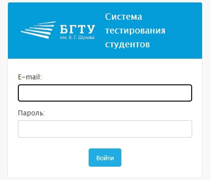
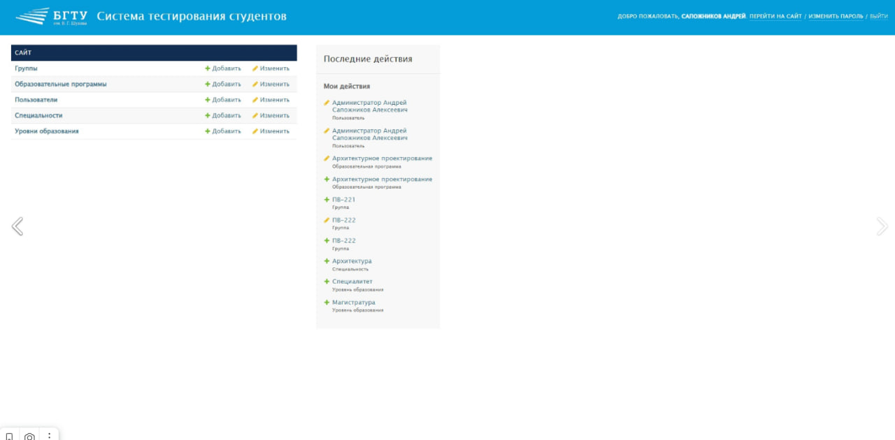
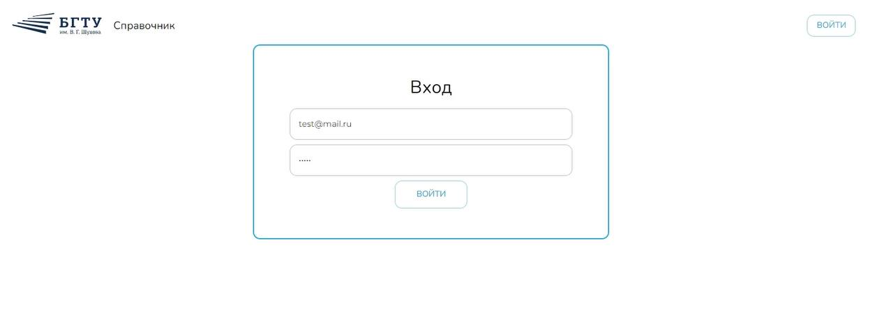
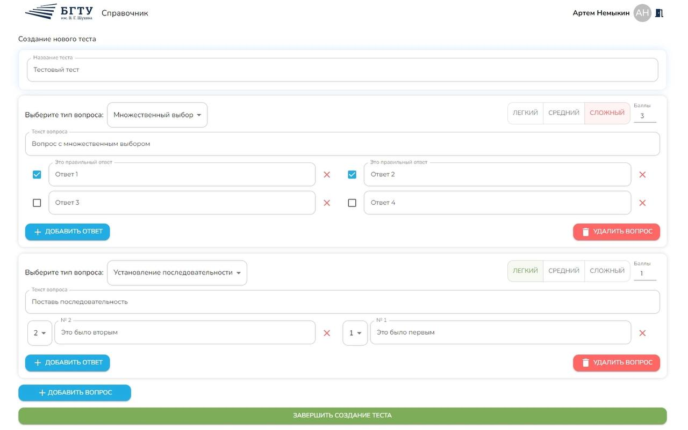
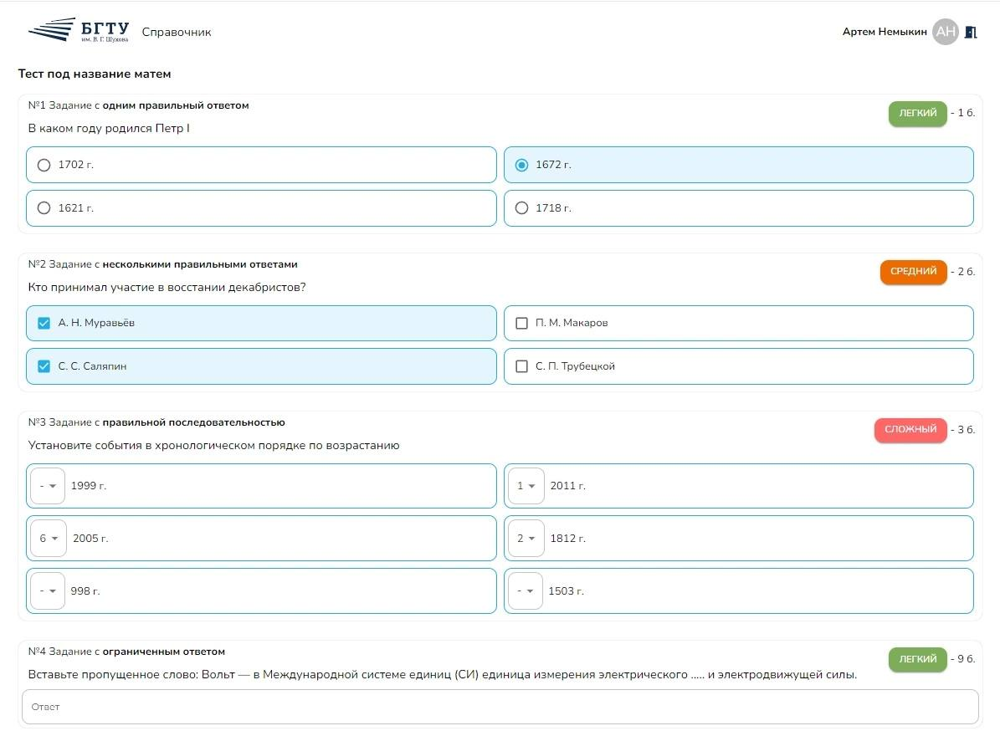
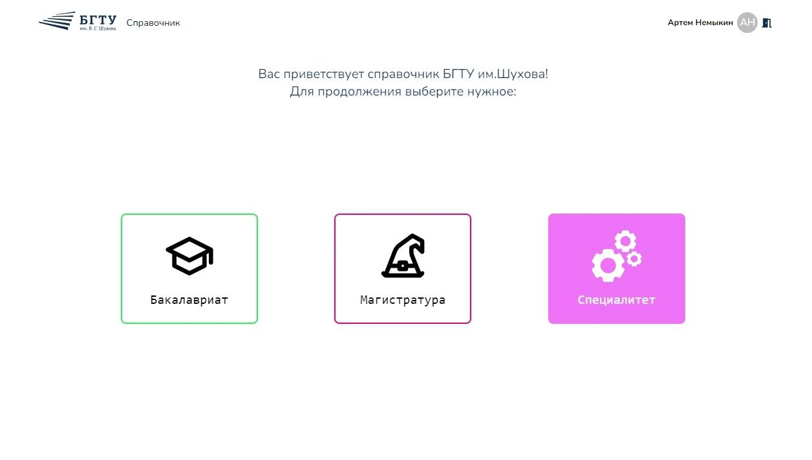

-----
## О проекте
<h5>Создание тестововой платформы для учащихся и студентов для БГТУ им.Шухова в рамках хакатона по веб-программированию</h5>
-----
#№ Функционал админ-панели

    
    

## Функционал сайта

    
    
    
    

